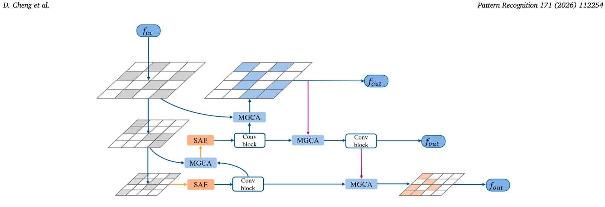
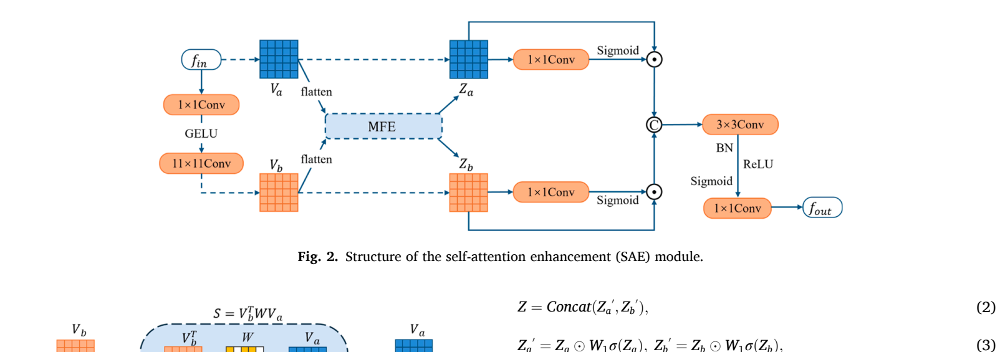
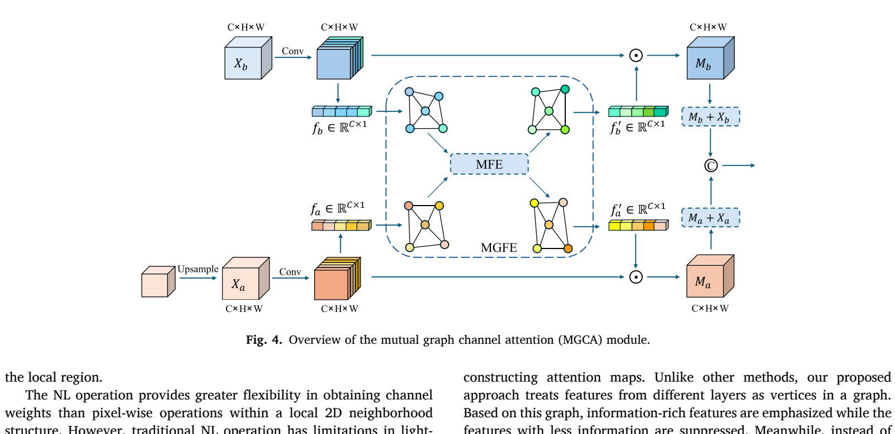

# MA-Neck

Official-style clean implementation for the paper **MA-Neck: Mutual attention-based feature enhancement for lightweight object detection**.

This repository contains a YOLOv5 baseline and the proposed MA-Neck modules for lightweight object detection. The codebase was cleaned from the research workspace for open-source release: training outputs, weights, dataset paths, W&B runs, caches, notebooks, and machine-specific files were removed.



## Paper

**MA-Neck: Mutual attention-based feature enhancement for lightweight object detection**  
Dongxu Cheng, Hao Li, Zifang Zhou, Yan Yang  
Pattern Recognition, 171, 112254, 2026  
DOI: [10.1016/j.patcog.2025.112254](https://doi.org/10.1016/j.patcog.2025.112254)

## Highlights

- A mutual attention-based neck for lightweight object detection.
- Self-attention enhancement (SAE) for improving foreground representation within each feature stage.
- Mutual graph channel attention (MGCA) for aggregating paired feature maps from different network stages.
- Clean YOLOv5 baseline configs and a YOLOv5n + MA-Neck config for direct comparison.

## Method

### Self-Attention Enhancement



### Mutual Graph Channel Attention



In this repository, the paper naming is used:

| Paper module | Code module | Description |
| --- | --- | --- |
| SAE | `SAE` | Self-attention enhancement for a single feature map |
| MGCA | `MGCA` | Mutual graph channel attention for paired feature maps |
| MSACA | `MSACA` | MA-Neck feature fusion block replacing plain PANet concat |

For compatibility with early experiment configs, `SCoA` is kept as an alias of `SAE`.

## Project Structure

```text
MA-Neck/
+-- assets/                     # Paper figures used in this README
+-- data/                       # Dataset yaml files and hyperparameters
+-- ma_neck/
|   +-- modules.py              # SAE, MGCA, MSACA and helper modules
+-- models/
|   +-- yolov5n.yaml            # YOLOv5n baseline
|   +-- yolov5s.yaml            # YOLOv5s baseline
|   +-- ma_neck-yolov5n.yaml    # YOLOv5n + MA-Neck
|   +-- common.py               # YOLOv5 modules plus MA-Neck imports
|   +-- yolo.py                 # Parser support for MA-Neck modules
+-- tests/
|   +-- test_modules.py         # Shape tests for MA-Neck modules
+-- train.py
+-- val.py
+-- detect.py
+-- requirements.txt
```

## Installation

```bash
git clone https://github.com/YOUR_NAME/MA-Neck.git
cd MA-Neck

python -m venv venv
source venv/bin/activate  # Windows: venv\Scripts\activate
pip install -r requirements.txt
```

Install the PyTorch build that matches your CUDA version if needed:

```bash
pip install torch torchvision --index-url https://download.pytorch.org/whl/cu121
```

## Dataset

The training and evaluation scripts follow the YOLOv5 dataset format.

```text
datasets/
+-- your_dataset/
    +-- images/
    |   +-- train/
    |   +-- val/
    +-- labels/
        +-- train/
        +-- val/
```

Create or edit a dataset yaml file under `data/`, for example:

```yaml
path: ../datasets/your_dataset
train: images/train
val: images/val

nc: 2
names: ["class0", "class1"]
```

## Training

Train the YOLOv5n baseline:

```bash
python train.py \
  --cfg models/yolov5n.yaml \
  --data data/your_dataset.yaml \
  --weights '' \
  --epochs 150 \
  --batch-size 16 \
  --img 640
```

Train YOLOv5n with MA-Neck:

```bash
python train.py \
  --cfg models/ma_neck-yolov5n.yaml \
  --data data/your_dataset.yaml \
  --weights '' \
  --epochs 150 \
  --batch-size 16 \
  --img 640
```

You can also start from pretrained YOLOv5 weights:

```bash
python train.py \
  --cfg models/ma_neck-yolov5n.yaml \
  --data data/your_dataset.yaml \
  --weights yolov5n.pt \
  --epochs 150 \
  --batch-size 16 \
  --img 640
```

## Evaluation

```bash
python val.py \
  --weights runs/train/exp/weights/best.pt \
  --data data/your_dataset.yaml \
  --img 640
```

## Inference

```bash
python detect.py \
  --weights runs/train/exp/weights/best.pt \
  --source path/to/images_or_video \
  --img 640 \
  --conf-thres 0.25
```

## Module Test

```bash
pytest tests
```

The shape tests check the standalone `SAE`, `MGCA`, and `MSACA` modules.

## Results

The paper reports consistent gains for lightweight detectors when replacing the original neck with MA-Neck. Please refer to the paper for full benchmark results on PASCAL VOC, VEDAI, DOTA, and COCOtrainval35k.

To reproduce your own baseline comparison, train:

1. `models/yolov5n.yaml`
2. `models/ma_neck-yolov5n.yaml`

with the same dataset, image size, epochs, optimizer, and augmentation settings.

## Citation

If this work is useful for your research, please cite:

```bibtex
@article{cheng2026maneck,
  title = {MA-Neck: Mutual attention-based feature enhancement for lightweight object detection},
  author = {Cheng, Dongxu and Li, Hao and Zhou, Zifang and Yang, Yan},
  journal = {Pattern Recognition},
  volume = {171},
  pages = {112254},
  year = {2026},
  doi = {10.1016/j.patcog.2025.112254}
}
```

## License

This repository is based on YOLOv5 and follows GPL-3.0-compatible terms. Please keep the original YOLOv5 license notice when redistributing or modifying the project.

## Acknowledgements

This implementation is built on the YOLOv5 codebase. Thanks to the YOLO community and related attention-mechanism research that inspired MA-Neck.
